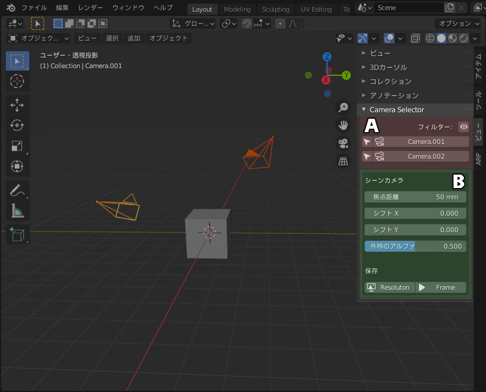

# CameraSelector README 日本語

## CameraSelector とは

CameraSelectorはBlenderのアドオンです。  
複数のカメラがあるシーンで、素早く目的のカメラに切り替えることができます。  
Blender2.92.0 で制作しました。

## 主な機能

- カメラごとに、異なったレンダー解像度を保存。
- カメラごとに、「現在のフレーム」を保存。
- カメラ切替時、保存した設定を自動でロードする。

## インストール

1. CameraSelector.pyをダウンロード
2. 編集 > プリファレンス > アドオン > インストール から、ダウンロードしたCameraSelector.pyをインストール。
3. "コミュニティ"タブから Camera:Camera Selector を有効に設定。
4. 3Dビュー のサイドバー > view > Camera Selector に追加されます。
5. インストールが終わったら、ダウンロードした CameraSelector.py は削除して構いません。

## アンインストール

1. 編集 > プリファレンス > アドオン と開き、コミュニティタブを選択
2. Camera:Camera Selector を探し、削除ボタンを押す

## インターフェイス



CameraSeclectorのインターフェイスは大きく２個のエリアにわけられます。

    A：カメラ選択エリア
    B：カメラプロパティエリア

### A：カメラ選択エリア


カメラ選択エリアには、現在のシーンにあるカメラの一覧が表示されます。  
各カメラの名前が付いたボタンを押せば、そのカメラがシーンのレンダリングに使用するアクティブカメラになります。

カメラ名の左にある矢印ボタンを押せば、そのカメラが選択されます。  
ちなみに、Shiftキーを押しながら矢印ボタンを押すと、追加選択・選択解除になります。

エリア右上にある目玉アイコンはフィルターボタンです。  
カメラの数が多いと、一覧が長くなり、目的のカメラを探すのに手間がかかります。  
目玉ボタンを押してフィルターをONにすると、非表示のカメラが一覧から除外されます。

### Ｂ：カメラプロパティエリア

カメラプロパティエリアには、レンダリングに使用するアクティブカメラのプロパティが表示されます。  
（注意：選択カメラではありません！）  
シーン内にレンダリングに使用するアクティブカメラが存在しない場合、このエリアは表示されません。


上の段には自分が良くアクセスするプロパティ「焦点距離」「シフトＸ,Ｙ」「外枠のアルファ」を用意しました。  
プロパティパネルを開かずとも、素早くアクセスするのが目的です。


下の段にはレンダリング画像のピクセル数と、現在のフレームを保存するボタンがあります。

Resolutionボタンを押すと、現在のレンダリング画像のピクセル数がカメラのカスタムプロパティに保存されます。  
カメラごとに異なったピクセル数でレンダリングしたい場合、それぞれのカメラに保存しておくと、CameraSelectorからカメラを切り替えた際、自動的にレンダリングピクセル数が変更されます。

Frameボタンを押すと、現在のフレー数がカメラのカスタムプロパティに保存されます。  
カメラごとに、レンダリングしたいフレームが違う場合、それぞれのカメラに保存しておくと、CameraSeclectorからカメラを切り替えた際、自動的に「現在のフレーム」が変更されます。


ResolutionボタンもFrameボタンも、その値はカメラのカスタムプロパティに保存されます。  
値を削除したい場合はカスタムプロパティから削除してください。

## その他


カメラプロパティ表示が不要と感じる場合、144~149行を # でコメントアウトすると、表示されなくなります。  
(注：この文章の意味がわからない方は、無視してください！)

```python
        layout.separator()
        if (SceneCam):
            box = layout.box()
            # box.label(text = "Scene Camera")
            # box.prop(SceneCam.data,"lens")
            # box.prop(SceneCam.data,"shift_x")
            # box.prop(SceneCam.data,"shift_y")
            # box.prop(SceneCam.data,"passepartout_alpha")
            # box.separator()
```